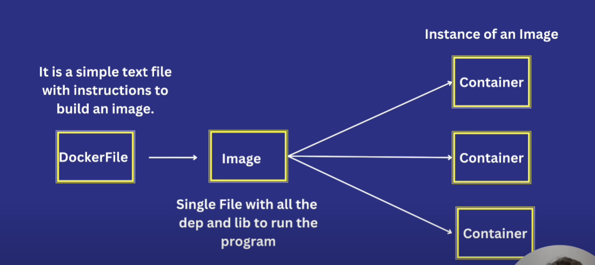
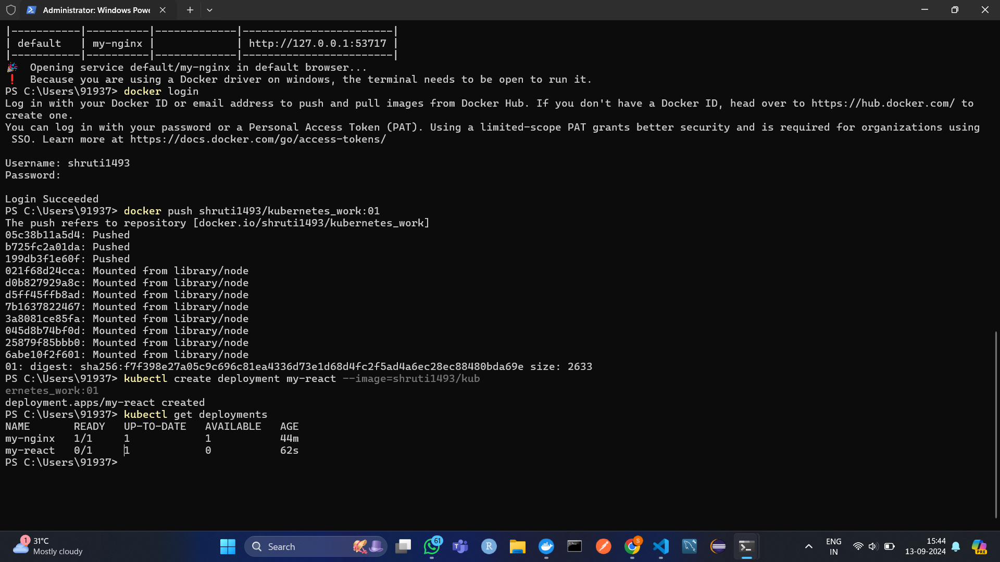
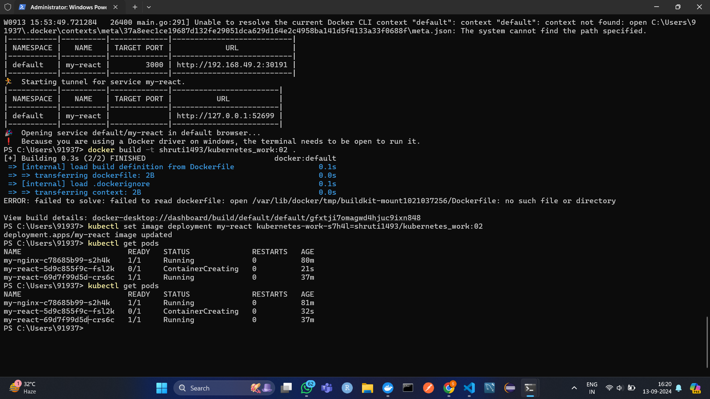
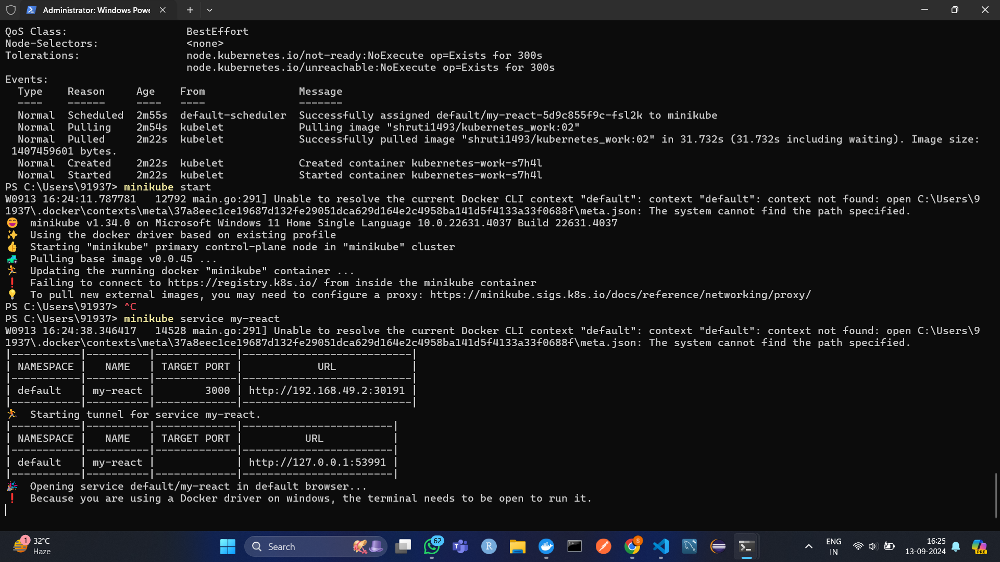

## Build Image from docker file
```bash
docker build -t shruti1493/kubernetes_work:01 .
```

## Login to Docker
```bash
docker login
```

## Push Image to Hub
```bash
docker push shruti1493/kubernetes_work:01
```

## Deploy App to Kubernetes
```bash
kubectl create deployment my-react --image=shruti1493/kubernetes_work:01
```


kubectl describe pods

kubectl expose deployment my-react --type=LoadBalancer --port=3000

minikube service my-react

## Push Updated changes

- Create new Image for updation

```bash
docker build -t shruti1493/kubernetes_work:02 .
```

- push new image to the repo

```bash
docker push shruti1493/kubernetes_work:02                  
```

# now in dep set prev image to new one, there should not be a downtime even for a second

```bash
kubectl set image deployment my-react [container name] kubernetes-work-s7h4l= [new image name] shruti1493/kubernetes_work:02
```

# start the minikube

```bash
minikube service my-react
```



